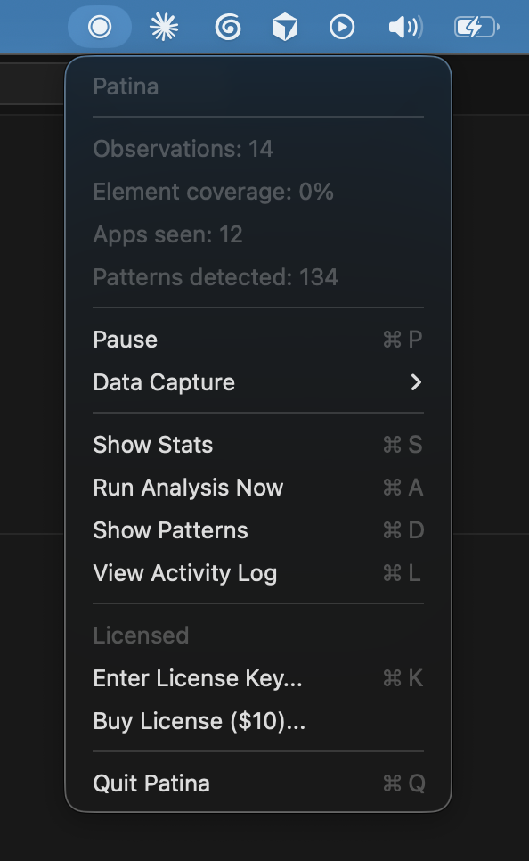

# Patina

A macOS app that watches how you work, learns your patterns, and tells you when it can do a task for you.



Patina reads the accessibility tree to observe which apps you use, what you click, and what you repeat. It sends structured metadata to a cloud LLM to detect patterns. When it is confident it can perform a step, it asks. You say yes or no — and then it does it. The human never prompts. The AI volunteers.

## What it observes

- Which app is active (bundle ID and name)
- Window titles (file paths and URLs stripped before storage)
- Focused UI element role and label (e.g. "button: Save", "text_field: Invoice Number")
- Timestamps and app switch events

## What it does not observe

- Screenshots or screen recordings — never
- Password fields — `AXSecureTextField` and heuristic detection for Electron apps
- Password manager apps — 1Password, Bitwarden, LastPass, Dashlane, KeePassXC, Enpass excluded by default
- File contents, audio, or camera
- Raw field values are not sent to the LLM — only element roles and labels

## What leaves your Mac

Nothing, until you configure analysis. With a license key or Together AI API key:

- App names, element roles, element labels, window titles (sanitized), event types, and timestamps are sent to Together AI for pattern detection
- No screenshots, no raw input values, no file paths, no URLs
- See `src/Analyzer.swift:buildPrompt()` for the exact payload

Without a key, Patina observes and stores locally. Nothing is sent anywhere.

The app requests `com.apple.security.network.client` (see `Patina.entitlements`) for the Together AI connection. No other network access.

## Build from source

Requires macOS 14+ and Xcode Command Line Tools (`xcode-select --install`). Builds on Apple Silicon. Intel not tested.

```bash
git clone https://github.com/MariusAure/patina.work.git
cd patina.work
./build.sh        # Compiles src/*.swift → ./patina binary
./bundle.sh       # Wraps binary in Patina.app bundle
open Patina.app   # Launch — grant Accessibility access when prompted
```

The build uses `swiftc` directly. No Xcode project, no SPM fetch, no dependencies beyond system frameworks and SQLite.

## Install from release

Read [`install.sh`](install.sh) first. It downloads a tarball from GitHub Releases, unpacks to `/Applications`, and removes quarantine.

```bash
curl -fsSL https://raw.githubusercontent.com/MariusAure/patina.work/main/install.sh | bash
```

The app is unsigned. macOS will block it. After installing:

1. System Settings > Privacy & Security > scroll down > "Open Anyway"
2. Grant Accessibility access when prompted
3. Look for the dot in your menu bar

## Architecture

| File | What it does |
|------|-------------|
| `Observer.swift` | Reads accessibility tree via AX APIs. Writes observations to SQLite. |
| `Database.swift` | SQLite storage. Observations, patterns, settings, coverage log. |
| `Sanitize.swift` | Strips file paths, URLs, emails from text before logging or LLM. |
| `CredentialDetector.swift` | Detects API keys, JWTs, credit cards, connection strings. Defense in depth. |
| `Analyzer.swift` | Sends batched observations to Together AI. Parses pattern responses. |
| `Notifier.swift` | macOS notifications for detected patterns. Rate-limited to 2/day. |
| `MenuBar.swift` | Menu bar UI. Stats, pause/resume, patterns, activity log. |
| `LogViewer.swift` | Activity log window. Search, filter, delete observations. |
| `Onboarding.swift` | First-run flow. Explains what Patina does, requests AX permission. |
| `PatternExporter.swift` | Exports patterns as markdown with credential redaction. |
| `License.swift` | Local license key validation. `pat_` + 32 hex chars. |
| `main.swift` | App entry point. Sets up DB, observer, analyzer, menu bar. |

## Data storage

All data is in `~/Library/Application Support/Patina/patina.db` (SQLite). You can query it directly:

```bash
sqlite3 ~/Library/Application\ Support/Patina/patina.db \
  'SELECT app_name, COUNT(*) c FROM observations GROUP BY app_name ORDER BY c DESC LIMIT 10;'
```

Delete everything from the Activity Log (menu bar > View Activity Log > Delete All), or:

```bash
sqlite3 ~/Library/Application\ Support/Patina/patina.db 'DELETE FROM observations;'
```

## License

MIT. See [LICENSE](LICENSE).

Built by [Trout Technologies AS](https://patina.work). Security issues: see [SECURITY.md](SECURITY.md).
